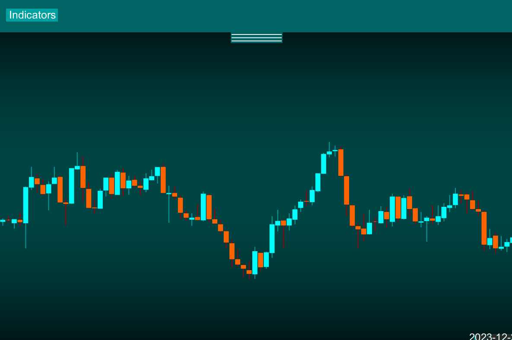
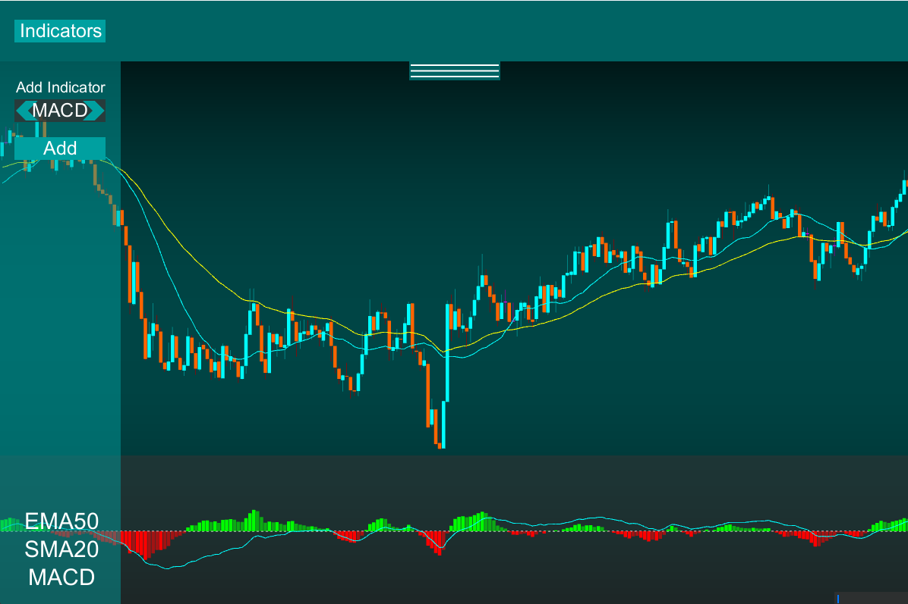
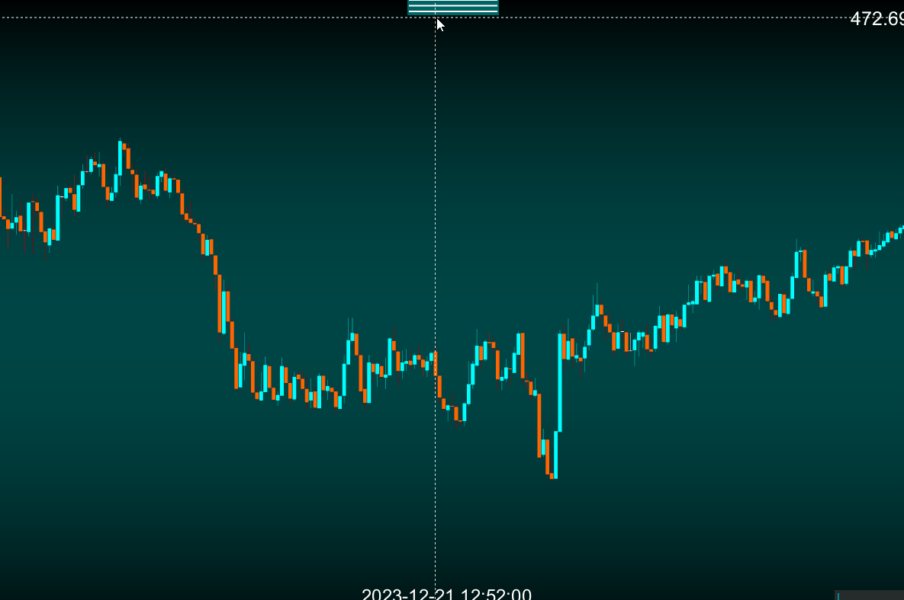
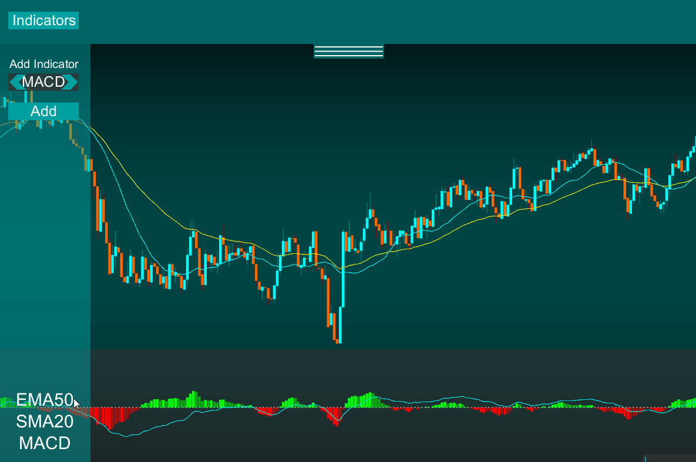

# Trade Companion

TradeCompanion is an *OLD and VERY MESSY* project of mine from college. 

TradeCompanion is a primative Stock Charting platform. The platofrm includes general charting capabilities including:
- Charting Controls & Scaling
- Live Data
- Indicators

I was experimenting with displaying and calculating stock data... for fun ya know... Do not expect any code in here to be clean. BUT, some of the tools I have coded during this process were incredibly well written. Their legacy will live on in my new repository *Trade Scavenger*

# Charting

*Display*
- A price line & cross line is displayed when the mouse is hovered
- The DateTime is displayed at the bottom of the screen for the hovered candle
- A TopBar is located with Indicator control at the top of the screen, which can be retracted

*Controls*
- Like other charting software, the chart can be scaled by the user. Controls are as follows:
  - Right click & drag: Scale vertically
  - Scroll Up/Down: Scale Horizontally
  - Clikc & Drag: Move the chart

# Indicators

Indicators that were coded for this platofrm include:
- EMA
- SMA
- MACD

*Adding Indicators*
- To add an indicator, go the top bar, click Indicators, and a selection menu will appear on the side to add your choice of indicator with applicable settings
  

*Removing Indicators*
- To remove an indicator, go to the indicator menu, hover over a name in the list, then click!

# File Storage
Trade Companion plots stock data stored in stock_data/TICKER_TIMEFRAME.csv

The data is in the same format as data retrieved form my StockDownlaoder application. Please refer to that repository

In order to load in new stock data to the chart, you must place a data CSV in the stock_data/ folder at the root of the project

Items included in this repository: 
- Indicator Builders
- Historical Indicator Calculators
- Full chart navigation with visible indicators
